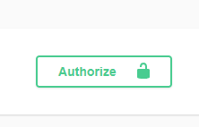

# Хранилище вопросов Тестовое задание №2 для Bewise.ai.

>Ссылка на первое задание: https://github.com/alxotsu/QuestionsStorage.git

Приложение реализует регистрацию и авторизацию пользователей. Пользователи могут загружать через специальный эндпоинт
.wav звуковые файлы, которые конвертируются в .mp3, который потом можно скачать по ссылке, предоставленной в ответе на запрос.
Скачать .mp3 файл может только пользователь, который загрузил соответствующий .wav файл.
Конвертация файла происходит в фоновой задаче с использованием redis и celery.

## Инструкция по размещению
Для размещения проекта необходим Docker. 
В корне проекта создайте файл ".env", в файле нужно написать "DEBUG=1" или "DEBUG=0" для того, чтобы запустить
flask приложение в режими отладки или в боевом режими соответственно.

После этого в корне проекта нужно выполнить команду:

```
docker-compose up
```

После создания контейнеров по порту 5432 будет доступна СУБД PostgreSQL

>Пользователь: user
>
>Пароль: password
>
>Название БД: db

По порту 5000 доступен веб-сервис.


После установки и успешного запуска контейнеров нужно зайти в терминал контейнера "flask" и ввести команду:

```
python createmodels.py
```


Команда создаёт таблицу в БД для храния экземпляров вопросов. После выполнения команды настройка приложения завершена.

## Пример использования
По url http://localhost:5000/apidocs/ находится swagger. 


Для работы с сервисом в первую очередь необходимо зарегистрироваться. Отправим следующий запрос на эндпоинт для регистрации

```
curl -X POST "http://localhost:5000/user/Otsu/"

Ответ:
{
  "id": 1,
  "token": "a3d1c814-b010-4323-8a0c-5ad424e878fc"
}
```

Скопируем токен из ответа и вставим в форме авторизации на Swagger.




В папке [wav_examples](wav_examples) находятся примеры .wav файлов, один из которых мы отправим в POST запросе на эндпоинт record.

```
curl -X POST "http://localhost:5000/record/?user=1" -H "Authorization: a3d1c814-b010-4323-8a0c-5ad424e878fc" -H "Content-Type: multipart/form-data" -F "file=@sample-15s.wav;type=audio/wav"

Ответ:
"http://localhost:5000/record/?id=f53f8c89-0330-4801-a366-cf95c7dcd2aa&user=1"
```

Из полученной ссылки скопируем id записи и отправим GET запрос на тот же эндпоинт.

```
curl -X GET "http://localhost:5000/record/?user=1&id=f53f8c89-0330-4801-a366-cf95c7dcd2aa" -H "Authorization: a3d1c814-b010-4323-8a0c-5ad424e878fc" --output output.mp3

Ответ:
В ответе содержится .mp3 файл. К сожалению, в Swagger нельзя проверить содержимое файла. Запрос был выполнен в терминале cmd.exe
В результате выполнения команды образовывался файл output.mp3, который можно проверить.
```

Обработка файла происходит довольно быстро, но если файл будет болшего размера, чем в примерах, конвертация может занять
ощутимо большое время, поэтому обработка файла была вынесена в фон.

> Аналогичным образом может быть обработан любой другой .wav файл из папки с примерами или из другого источника.

## Использованный стэк

- Flask restful
- Docker
- PostgreSQL
- SQLAlchemy
- flasgger
- redis
- celery
